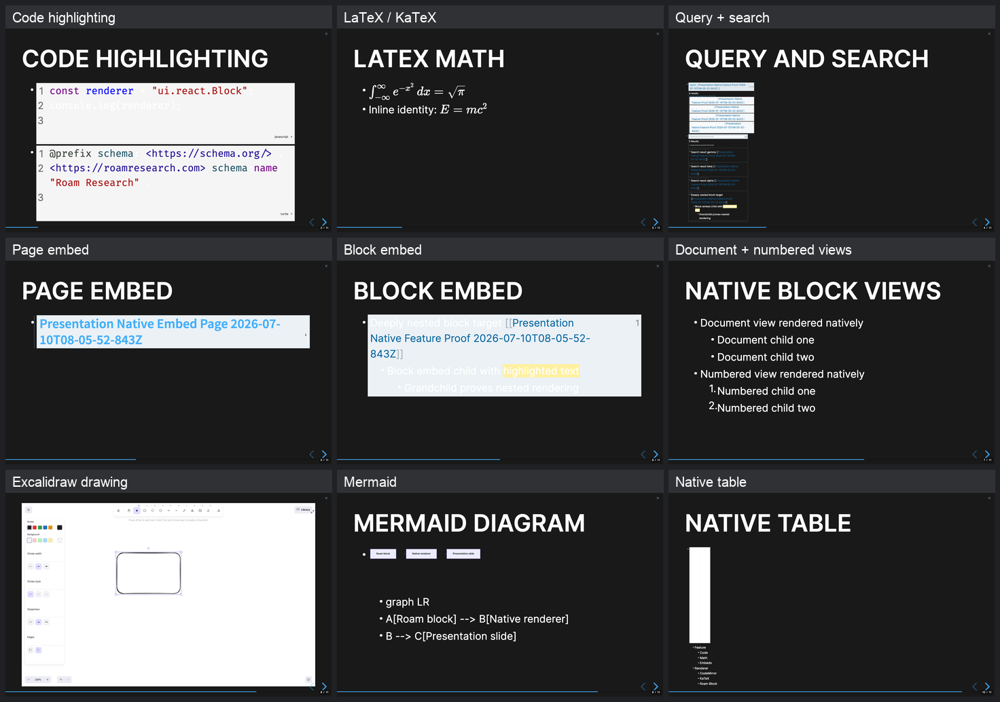

# Native feature coverage

This deck was generated in the authenticated Roam test graph and rendered
through `presentation2` at 1440×900. It exercises content that historically
failed when Presentation reconstructed blocks as custom HTML.

## Screenshots

1. [Code highlighting](raw/02-code-highlighting.png) — JavaScript and Turtle
   rendered in two native code editors with syntax highlighting.
2. [LaTeX / KaTeX](raw/03-latex-math.png) — display and inline math both
   rendered by Roam.
3. [Query and search](raw/04-query-and-search.png) — a live query and search
   result view returned graph blocks, paths, formatting, and nested content.
4. [Page embed](raw/05-page-embed.png) — Roam's native page-embed component.
5. [Block embed](raw/06-block-embed.png) — nested children and highlighted
   inline markup preserved inside the embed.
6. [Document and Numbered views](raw/07-native-block-views.png) — the two
   source blocks retain their graph view types in the slide.
7. [Excalidraw initialized](excalidraw-editor-before-drawing.png) and
   [rectangle drawn](excalidraw-editor-after-drawing.png) — the extension-owned
   editor opens inside the active Reveal slide and receives drawing input.
8. [Mermaid](raw/09-mermaid.png) — the extension-owned diagram renderer emits
   its SVG inside the slide.
9. [Native table](raw/10-native-table.png) — Roam's table component mounts and
   remains interactive, although its default sizing is small in this theme.

## Verification result

The final capture completed on 2026-07-10 with 11 slides, zero page errors,
and zero visible `.rm-multibar` indentation guides. Automated DOM checks found:

- 2 native code editors
- 2 KaTeX renders
- 1 live search view plus query results
- 1 page embed and 1 block embed
- Document and Numbered children-view types
- 1 Excalidraw component, 2 canvases, and a rectangle drawn on the interactive
  canvas
- 1 Mermaid SVG
- 1 native table

[`capture-result.json`](capture-result.json) contains the live fixture UIDs,
per-slide DOM metrics, Excalidraw pointer target and coordinates, viewport, and
page-error result. The raw title, feature, and end-slide captures are retained
under [`raw`](raw).

Encrypted-graph images, Google Drive-backed images, and arbitrary third-party
extension components remain account- or graph-dependent manual cases. Mermaid
and Excalidraw provide deterministic extension-lifecycle coverage here.
