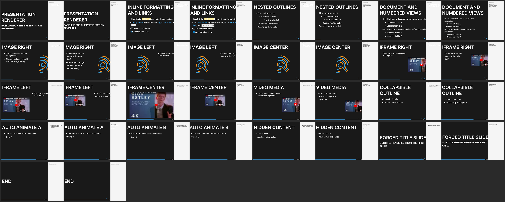

# Post-fix slide-by-slide renderer comparison

Every comparison joins two 1440×900 browser captures from the same live Roam
fixture and slide position:

- Left: current `presentation` renderer
- Right: `presentation2` native renderer

The authenticated capture completed on 2026-07-10 with 17 slides in each deck
and no page errors. The native slides retain Roam's bullet markers and inline
page-reference brackets while suppressing the block indentation guides.

1. [Title](comparisons/01-title.png)
2. [Inline formatting](comparisons/02-inline-formatting.png)
3. [Nested outlines](comparisons/03-nested-outlines.png)
4. [Document and numbered views](comparisons/04-document-and-numbered-views.png)
5. [Image Right](comparisons/05-image-right.png)
6. [Image Left](comparisons/06-image-left.png)
7. [Image Center](comparisons/07-image-center.png)
8. [Iframe Right](comparisons/08-iframe-right.png)
9. [Iframe Left](comparisons/09-iframe-left.png)
10. [Iframe Center](comparisons/10-iframe-center.png)
11. [Video media](comparisons/11-video-media.png)
12. [Collapsible outline](comparisons/12-collapsible-outline.png)
13. [Auto Animate A](comparisons/13-auto-animate-a.png)
14. [Auto Animate B](comparisons/14-auto-animate-b.png)
15. [Hidden content](comparisons/15-hidden-content.png)
16. [Forced title slide](comparisons/16-forced-title-slide.png)
17. [End](comparisons/17-end.png)

The title slides now use the same left alignment and effective Inter typography
as the parsed baseline. Native block bullets are visible, the `.rm-multibar`
indentation guides are hidden, and legacy video media is contained inside its
configured half-slide rather than escaping across the presentation.

Some text wrapping and embed sizing remain intentionally renderer-native. The
new renderer preserves the literal `[[page reference]]` brackets and Roam's own
iframe/media subtree instead of reconstructing either as custom HTML.

The original source captures are under `raw/original`; the native source
captures are under `raw/native`. `capture-result.json` records the fixture UIDs,
computed layout metrics, viewport, slide order, and page-error status.
