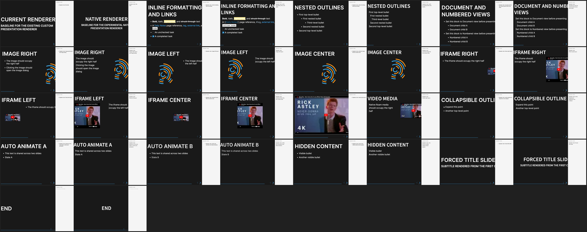

# Slide-by-slide renderer comparison

Every image joins two pixel-faithful 1440×900 browser captures from the same
fixture and slide position:

- Left: current `presentation` renderer
- Right: experimental `presentation2` native renderer

Both decks produced 17 visible slides and the capture completed without page
errors. `contact-sheet.png` provides a quick overview; the full-resolution
2880×900 comparisons are linked below.

1. [Title](comparisons/01-title.png)
2. [Inline formatting](comparisons/02-inline-formatting.png)
3. [Nested outlines](comparisons/03-nested-outlines.png)
4. [Document and numbered views](comparisons/04-document-and-numbered-views.png)
5. [Image Right](comparisons/05-image-right.png)
6. [Image Left](comparisons/06-image-left.png)
7. [Image Center](comparisons/07-image-center.png)
8. [Iframe Right](comparisons/08-iframe-right.png)
9. [Iframe Left](comparisons/09-iframe-left.png)
10. [Iframe Center](comparisons/10-iframe-center.png)
11. [Video media](comparisons/11-video-media.png)
12. [Collapsible outline](comparisons/12-collapsible-outline.png)
13. [Auto Animate A](comparisons/13-auto-animate-a.png)
14. [Auto Animate B](comparisons/14-auto-animate-b.png)
15. [Hidden content](comparisons/15-hidden-content.png)
16. [Forced title slide](comparisons/16-forced-title-slide.png)
17. [End](comparisons/17-end.png)

## Visible mismatch groups

- Native block content preserves Roam's block-tree chrome and indentation
  guides instead of the current renderer's bullet markers.
- The native inline-formatting slide displays page-reference brackets that the
  current renderer omits.
- Image and iframe sizing and text wrapping differ across the split layouts.
- Media Right differs substantially: the current renderer fills most of the
  slide, while the native renderer retains the configured split layout.
- Title and forced-title alignment and clipping differ when speaker notes are
  shown.

The source captures are retained under `raw/original` and `raw/native` for
pixel-level inspection. `capture-result.json` records slide order, titles,
fixture identifiers, viewport, and page-error status.
